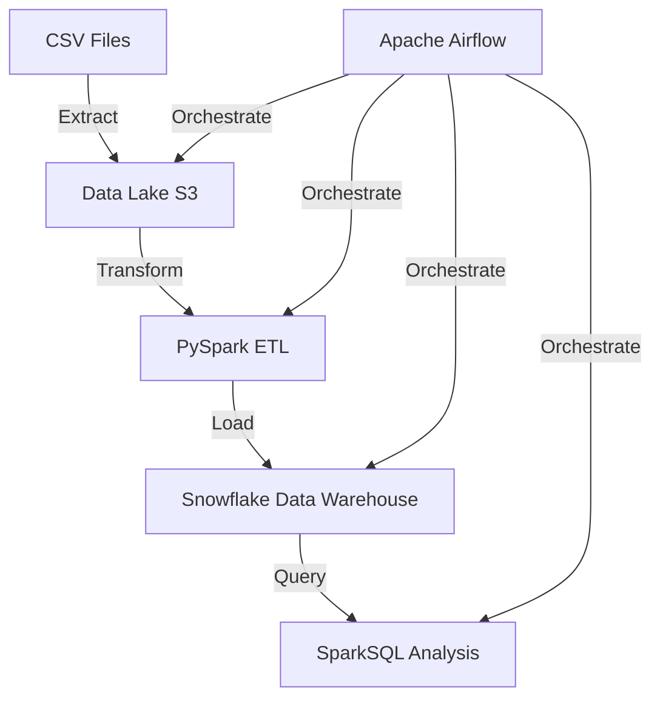
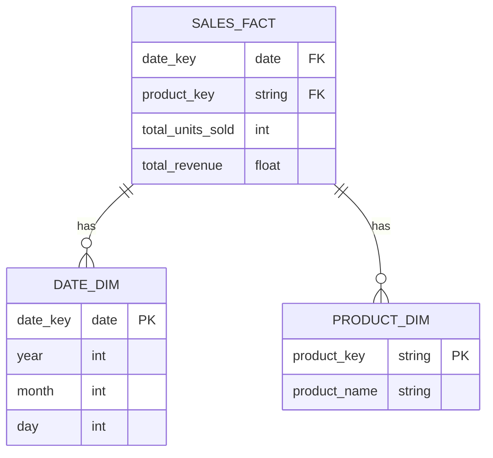

# Retail Data Pipeline

## Table of Contents

1. [Project Overview](#project-overview)
2. [System Architecture](#system-architecture)
3. [Setup and Installation](#setup-and-installation)
4. [Running the Pipeline](#running-the-pipeline)
5. [Data Lake Design](#data-lake-design)
6. [Data Warehouse Schema](#data-warehouse-schema)
7. [ETL Process](#etl-process)
8. [Data Analysis](#data-analysis)
9. [Pipeline Orchestration](#pipeline-orchestration)
10. [Scalability and Performance](#scalability-and-performance)
11. [Security Measures](#security-measures)
12. [Future Enhancements](#future-enhancements)
13. [Acknowledgements](#acknowledgements)


## Project Overview

This retail data pipeline processes sales data from raw CSV files, transforms it using PySpark, stores it in a Snowflake data warehouse, and performs analysis using SparkSQL. The entire process is orchestrated using Apache Airflow.

Data Source url: `https://www.kaggle.com/datasets/ksabishek/product-sales-data`

## System Architecture

Our data pipeline consists of the following key components:

1. Data Source (CSV files)
2. Data Lake (Amazon S3)
3. ETL Process (PySpark)
4. Data Warehouse (Snowflake)
5. Data Analysis (SparkSQL)
6. Orchestration (Apache Airflow)

### Data Flow Diagram


### Setup and Installation

1. Install Docker Desktop
2. Clone the repository: `git clone https://github.com/amberpande/retail_data_pipeline.git`
3. cd retail_data_pipeline
4. Create a free AWS account -> create a S3 bucket with Https access -> create `data` folder and updload the csv data file the datasource
5. Create a free Snowflake account

Replace the placeholders with your credentials in `scripts/config.py`.


## Running the Pipeline

1. Ensure your raw CSV files are in the S3 bucket specified in your configuration.

2. run `docker-compose build` then `docker-compose up`

3. Access the Airflow UI at `http://localhost:8080`, credentials: username- airflow, password- airflow.

4. Enable the `retail_data_pipeline` DAG.

5. The pipeline will run according to the schedule defined in the DAG. You can also trigger it manually from the Airflow UI.

### Data Lake Design

- My S3 data lake has the following structure:

```
s3://retailsalesetl/
├── data/
│   └── statsfinal.csv
└── processed/
    └── output_YYYYMMDDHHMMSS.csv
```

The data/ folder contains the original CSV files, while the processed/ folder contains the transformed data files ready for loading into Snowflake.

## Data Warehouse Schema

I used a Star Schema in our Snowflake data warehouse for efficient querying of sales data:



## ETL Process

ETL process uses PySpark to transform the data. Key steps include:

1. Extract: Read CSV files from S3
2. Transform:
   - Clean and validate data
   - Convert date strings to date objects
   - Calculate aggregates (total_units_sold, total_revenue)
3. Load: Write transformed data to Snowflake

## Data Analysis

I used SparkSQL for data analysis. Key analyses include:

1. Total sales by product
2. Monthly sales trends
3. Top-selling products
4. Average revenue per sale

## Pipeline Orchestration

I used Apache Airflow to orchestrate the pipeline. The DAG includes the following tasks:

1. Check for new data in S3
2. Trigger PySpark ETL job
3. Load data into Snowflake
4. Run SparkSQL analysis
5. Generate reports

## Scalability and Performance

- Use of Spark for distributed processing of large datasets
- Snowflake's scalable compute resources for query performance
- Partitioning of data in S3 and Snowflake for efficient querying

## Security Measures

- Encryption of data at rest in S3 and Snowflake
- IAM roles for access control to AWS resources
- Snowflake's role-based access control for data warehouse

## Future Enhancements

- Implement real-time data processing with Spark Streaming
- Expand data sources to include point-of-sale systems
- Develop machine learning models for sales prediction


## Acknowledgements

- [Apache Airflow](https://airflow.apache.org/)
- [Apache Spark](https://spark.apache.org/)
- [Snowflake](https://www.snowflake.com/)
- [Amazon S3](https://aws.amazon.com/s3/)


This combined README.md provides a comprehensive overview of your project, including its architecture, setup instructions, operational details, and analysis results.

The images (total_sales_by_product.png and total_sales_by_product.png) should be generated by the data analysis script and saved in an `visualizations` folder in your project directory.
